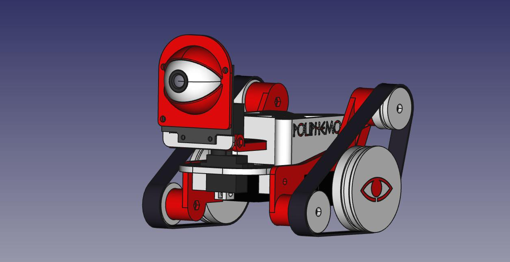

<table>
<tr>
<td>

</td>
</tr>
</table>

# Poliphemo

Poliphemo es un printBot (Robot cuyas piezas están fabricadas con una impresora 3D) y que ha sido diseñado, en principio, para experimentar y aprender con la cámara Pixy CMU5Cam. Pero esta característica, no debe ser limitante, o sea, el robot está diseñado de forma que cualquier persona que no tenga esa cámara, pueda imprimirse las piezas del robot sustituyendo dicho sensor por otro cualquiera, por ejemplo, un sensor de ultrasonidos.

Además, la idea es que se le puedan acoplar otros tipos de sensores: infrarrojos para siguelíneas, sensores de luz, etc. Y a ser posible con un sistema que permita el cambio rapido de sensores y que se adapte a la forma de cualquier tipo de sensor (siempre que sea factible por tamaño)

# Licencia

